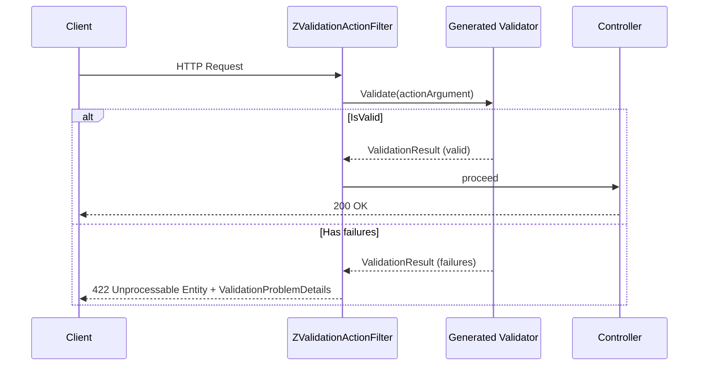

## Installation

Two NuGet packages are required:

```bash
dotnet add package ZeroAlloc.Validation
dotnet add package ZeroAlloc.Validation.AspNetCore
```

## Setup in Program.cs

```csharp
builder.Services.AddControllers();
builder.Services.AddZValidationAutoValidation();
```

`AddZValidationAutoValidation()` is source-generated — it lives in the generated code, not in a library method. It:

- Registers each discovered validator as `Transient` via `TryAddTransient<TValidator>()`
- Registers `ZValidationActionFilter` as `Transient`
- Adds `ZValidationActionFilter` to `MvcOptions.Filters`

## How it works

The generated `ZValidationActionFilter` implements `IActionFilter` and intercepts every incoming request:

- `OnActionExecuting` iterates over `context.ActionArguments.Values`
- For each argument, calls a generated type-switch `Dispatch(arg)` method
- If validation fails: short-circuits the request and returns HTTP **422 Unprocessable Entity** with `ValidationProblemDetails`
- On success: the request proceeds to the controller

The type-switch is generated at build time — there is no reflection and no dictionary lookup at runtime.



## Response format

On validation failure, the filter returns:

- HTTP **422 Unprocessable Entity**
- Body: `ValidationProblemDetails` with an `errors` dictionary
- Each key is the `PropertyName` from the failure (e.g., `"Email"`, `"ShippingAddress.Street"`)
- Each value is an array of error message strings

Example response:

```json
{
  "type": "https://tools.ietf.org/html/rfc4918#section-11.2",
  "title": "One or more validation errors occurred.",
  "status": 422,
  "errors": {
    "Email": ["Email must not be empty.", "Email must be a valid email address."],
    "Amount": ["Amount must be greater than 0."]
  }
}
```

## DI lifetimes

By default, all validators are registered as `Transient`. This is safe because validators are stateless.

If you annotate your model class with `[Transient]`, `[Scoped]`, or `[Singleton]` from the **ZeroAlloc.Inject** package, the source generator mirrors that lifetime onto the generated validator class. `AddZValidationAutoValidation()` still uses `TryAddTransient` (and will not override an explicitly registered validator), so your lifetime attribute takes precedence.

> **Note:** `[Transient]`, `[Scoped]`, and `[Singleton]` come from the **ZeroAlloc.Inject** package, which is a separate NuGet package. ZeroAlloc.Validation itself does not define these attributes.

## Accessing the result manually

You can also inject and call validators directly in a controller, without using the action filter:

```csharp
public class OrdersController : ControllerBase
{
    private readonly OrderValidator _validator;

    public OrdersController(OrderValidator validator) => _validator = validator;

    [HttpPost]
    public IActionResult Create([FromBody] CreateOrderRequest request)
    {
        var result = _validator.Validate(request);
        if (!result.IsValid)
        {
            var pd = new ValidationProblemDetails();
            foreach (ref readonly var f in result.Failures)
            {
                if (!pd.Errors.ContainsKey(f.PropertyName))
                    pd.Errors[f.PropertyName] = Array.Empty<string>();
                pd.Errors[f.PropertyName] = [.. pd.Errors[f.PropertyName], f.ErrorMessage];
            }
            return UnprocessableEntity(pd);
        }
        // process valid request...
        return Ok();
    }
}
```
