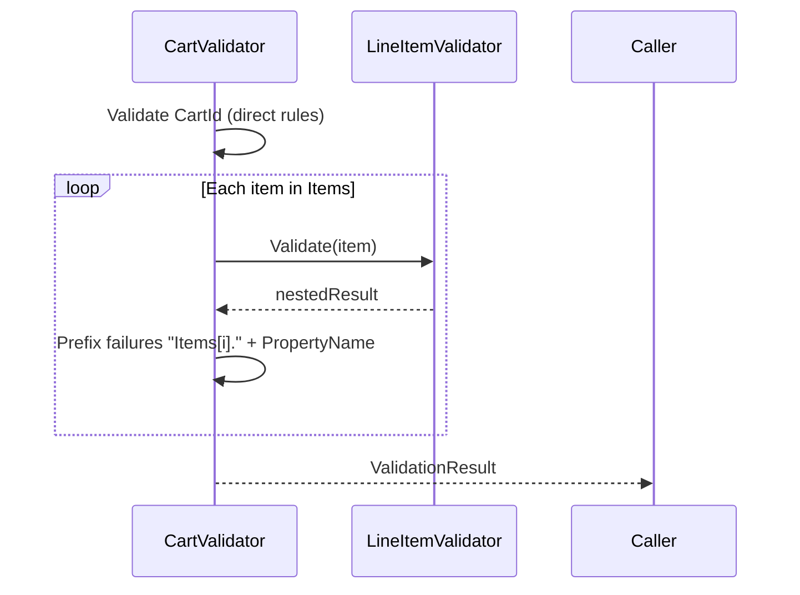

## Overview

ZeroAlloc.Validation supports validating `List<T>`, `T[]`, and any `IEnumerable<T>` property. The generator iterates the collection at validation time and runs the appropriate element validator on each item, prefixing each failure path with the item's index (e.g., `Items[1].Sku`).

The element type must either:

- carry `[Validate]` — in which case the generator auto-wires collection validation with no extra attribute on the property, or
- be specified explicitly via `[ValidateWith(typeof(MyValidator))]` on the collection property, for element types you do not control.

---

## Automatic collection validation

When a property's element type is decorated with `[Validate]`, the source generator detects the collection automatically. No additional attribute is required on the property itself.

```csharp
[Validate]
public class Cart
{
    [NotEmpty]
    public string CartId { get; set; } = "";

    public List<LineItem> Items { get; set; } = [];
}

[Validate]
public class LineItem
{
    [NotEmpty]
    public string Sku { get; set; } = "";

    [GreaterThan(0)]
    public int Quantity { get; set; }
}
```

Because `LineItem` is annotated with `[Validate]`, the generator produces a `LineItemValidator` and injects it into `CartValidator` via constructor. No configuration is required on the `Items` property.

---

## Index-prefixed failure paths

Failures from collection items appear as `"Items[0].Sku"`, `"Items[1].Quantity"`, etc. The generator emits the following pattern for each collection property:

```csharp
PropertyName = "Items[" + _c0Idx + "]." + f.PropertyName
```

The index counter increments after every item, including null items that are skipped, so index values always correspond to the item's position in the original collection.

**Example:**

```csharp
var cart = new Cart
{
    CartId = "CART-001",
    Items = new List<LineItem>
    {
        new LineItem { Sku = "SKU-A", Quantity = 2 },   // valid
        new LineItem { Sku = "",      Quantity = 0 },   // two failures
        new LineItem { Sku = "SKU-C", Quantity = -1 },  // one failure
    }
};

var result = validator.Validate(cart);
foreach (ref readonly var f in result.Failures)
    Console.WriteLine($"{f.PropertyName}: {f.ErrorMessage}");
// Output:
// Items[1].Sku: Sku must not be empty.
// Items[1].Quantity: Quantity must be greater than 0.
// Items[2].Quantity: Quantity must be greater than 0.
```

The `foreach (ref readonly var f in result.Failures)` enumeration is zero-copy — no `ValidationFailure` structs are boxed or copied.

---

## [ValidateWith] for collection elements

For element types that do not carry `[Validate]` (third-party or external types), apply `[ValidateWith(typeof(MyValidator))]` directly to the collection property. The attribute specifies the **element** validator, not a collection validator — the generator handles the iteration automatically.

```csharp
public class ExternalProduct { ... }

public class ProductValidator : ValidatorFor<ExternalProduct>
{
    public override ValidationResult Validate(ExternalProduct instance)
    {
        // custom rules
        return new ValidationResult([]);
    }
}

[Validate]
public class Order
{
    [ValidateWith(typeof(ProductValidator))]
    public List<ExternalProduct> Products { get; set; } = [];
}
```

The `typeof` form is the only supported form. `[ValidateWith]` is valid on any collection property regardless of element type; it overrides auto-detection when both are applicable.

---

## Supported collection types

Any type implementing `IEnumerable<T>` is supported. This includes:

- `T[]`
- `List<T>`
- `IList<T>`
- `ICollection<T>`
- `IEnumerable<T>`

The generator identifies collection properties by checking whether the property type is `T[]`, directly `IEnumerable<T>`, or implements `IEnumerable<T>`.

---

## Null handling

**Null collection property:** If the collection property itself is null, validation is skipped entirely. The generated code wraps the loop in `if (instance.Items is not null)`, so no `NullReferenceException` is thrown.

**Null elements within the collection:** Individual null items are skipped. The generator wraps each element validation call in `if (_c0Item is not null)`. However, the index counter still increments for null elements so that the reported indices remain positionally accurate.

**Generated loop structure (simplified):**

```csharp
if (instance.Items is not null)
{
    int _c0Idx = 0;
    foreach (var _c0Item in instance.Items)
    {
        if (_c0Item is not null)
        {
            var _c0Result = _lineItemValidator.Validate(_c0Item);
            foreach (ref readonly var f in _c0Result.Failures)
            {
                failures.Add(f with { PropertyName = "Items[" + _c0Idx + "]." + f.PropertyName });
            }
        }
        _c0Idx++;
    }
}
```

The element validator is injected via constructor, consistent with how nested object validators are wired.

---

## Validation flow


