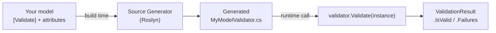

## Installation

Add the core library to your project. The integration and testing packages are optional.

**Core library (required)**

```bash
dotnet add package ZeroAlloc.Validation
```

**ASP.NET Core auto-validation (optional)**

```bash
dotnet add package ZeroAlloc.Validation.AspNetCore
```

**Test assertion helpers (optional)**

```bash
dotnet add package ZeroAlloc.Validation.Testing
```

## How it works

ZeroAlloc.Validation uses a Roslyn source generator that runs at **compile time**, not at runtime. It inspects your annotated models and emits a `partial class` that extends `ValidatorFor<T>`. The result is pure IL — no reflection, no expression trees, and no allocations on the hot path.



## Annotate your model

Apply `[Validate]` to a class, then annotate each property with the constraint attributes you need:

```csharp
using ZeroAlloc.Validation;

[Validate]
public class RegisterUserRequest
{
    [NotEmpty][MaxLength(100)] public string Username { get; set; } = "";
    [NotEmpty][MinLength(8)]   public string Password { get; set; } = "";
    [NotEmpty][EmailAddress]   public string Email    { get; set; } = "";
}
```

The generator emits `RegisterUserRequestValidator` in the same namespace as your model. For flat models like this one (no nested validated properties), the generated validator has a parameterless constructor.

## Call the validator

Instantiate the generated validator and call `Validate`. The returned `ValidationResult` exposes `IsValid` and a zero-allocation `Failures` span:

```csharp
var validator = new RegisterUserRequestValidator();

var result = validator.Validate(new RegisterUserRequest
{
    Username = "",
    Password = "abc",
    Email    = "not-an-email"
});

Console.WriteLine(result.IsValid); // false

foreach (ref readonly var failure in result.Failures)
    Console.WriteLine($"[{failure.PropertyName}] {failure.ErrorMessage}");
// [Username] 'Username' must not be empty.
// [Password] 'Password' must be at least 8 characters.
// [Email] 'Email' is not a valid email address.
```

Each `ValidationFailure` carries:
- `PropertyName` — the name of the property that failed
- `ErrorMessage` — a human-readable description of the failure
- `ErrorCode` — an optional machine-readable code
- `Severity` — `Error`, `Warning`, or `Info`

## Next steps

- [Attribute Reference](attributes.md) — all 25+ built-in attributes
- [Nested Validation](nested-validation.md) — validating nested objects
- [Collection Validation](collection-validation.md) — validating lists and arrays
- [ASP.NET Core Integration](aspnetcore.md) — auto-validation in controllers
