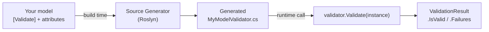

## Installation

Add the core library to your project. The integration and testing packages are optional.

**Core library (required)**

```bash
dotnet add package ZeroAlloc.Validation
```

**ASP.NET Core auto-validation (optional)**

```bash
dotnet add package ZeroAlloc.Validation.AspNetCore
```

**Test assertion helpers (optional)**

```bash
dotnet add package ZeroAlloc.Validation.Testing
```

## How it works

ZeroAlloc.Validation uses a Roslyn source generator that runs at **compile time**, not at runtime. It inspects your annotated models and emits a concrete validator class (e.g. `RegisterUserRequestValidator`) that extends `ValidatorFor<T>`. No reflection, no expression trees — pure IL at build time. The result has no allocations on the hot path.


```mermaid
flowchart LR
    A["Your model\n[Validate] + attributes"] -->|"build time"| B["Source Generator\n(Roslyn)"]
    B --> C["Generated\nMyModelValidator.cs"]
    C -->|"runtime call"| D["validator.Validate(instance)"]
    D --> E["ValidationResult\n.IsValid / .Failures"]
```

## Annotate your model

Apply `[Validate]` to a class, then annotate each property with the constraint attributes you need:

```csharp
using ZeroAlloc.Validation;

[Validate]
public class RegisterUserRequest
{
    [NotEmpty][MaxLength(100)] public string Username { get; set; } = "";
    [NotEmpty][MinLength(8)]   public string Password { get; set; } = "";
    [NotEmpty][EmailAddress]   public string Email    { get; set; } = "";
}
```

The generator emits `RegisterUserRequestValidator` in the same namespace as your model. For flat models like this one (no nested validated properties), the generated validator has a parameterless constructor.

> **Target types.** `[Validate]` works on `class`, `record`, `readonly struct`, and
> `readonly record struct`. Decorating a non-readonly `struct` or `record struct`
> emits `ZV0014` (Warning) — a caller can mutate the instance between the
> validator returning success and the consumer reading the value, making the
> validation result stale. Prefer the `readonly` form for request types.

## Call the validator

Instantiate the generated validator and call `Validate`. The returned `ValidationResult` exposes `IsValid` and a zero-allocation `Failures` span:

```csharp
var validator = new RegisterUserRequestValidator();

var result = validator.Validate(new RegisterUserRequest
{
    Username = "",
    Password = "abc",
    Email    = "not-an-email"
});

Console.WriteLine(result.IsValid); // false

foreach (ref readonly var failure in result.Failures)
    Console.WriteLine($"[{failure.PropertyName}] {failure.ErrorMessage}");
// [Username] 'Username' must not be empty.
// [Password] 'Password' must be at least 8 characters.
// [Email] 'Email' is not a valid email address.
```

Each `ValidationFailure` carries:
- `PropertyName` — the name of the property that failed
- `ErrorMessage` — a human-readable description of the failure
- `ErrorCode` — an optional machine-readable code
- `Severity` — `Error`, `Warning`, or `Info`

## Validating value-object properties

If a property's type is decorated with `[ZeroAlloc.ValueObjects.ValueObject]` and exposes exactly one public instance property (a typed-id wrapper, for example), the built-in operand-style validators auto-unwrap through the wrapper. You annotate the wrapper; the generator emits the comparison against the underlying value.

```csharp
using ZeroAlloc.Validation;
using ZeroAlloc.ValueObjects;

[ValueObject]
public readonly partial struct CustomerId
{
    public int Value { get; }
    public CustomerId(int value) => Value = value;
}

[Validate]
public readonly record struct PlaceOrderCommand(
    [property: GreaterThan(0)] CustomerId CustomerId,
    [property: GreaterThan(0)] decimal Total);
```

The generator emits `instance.CustomerId.Value > 0` rather than trying to compare the wrapper itself — so `[GreaterThan]`, `[NotEmpty]`, `[InclusiveBetween]`, and the other operand-taking attributes "just work" against typed ids and other single-property value-objects.

**Predicate validators preserve the wrapper.** `[Must(nameof(IsKnown))]` passes the wrapper into your method, not the unwrap — the method signature is what the user wrote:

```csharp
[Validate]
public partial class PlaceOrderCommand
{
    [Must(nameof(IsKnown))]
    public CustomerId CustomerId { get; set; }

    public bool IsKnown(CustomerId id) => id.Value > 0;
}
```

**Multi-property value-objects.** Auto-unwrap only applies when the wrapper has a single underlying property. If you put a built-in operand validator on a multi-property value-object (e.g. a `Money { decimal Amount; string Currency; }`), the generator emits `ZV0016` (Warning) — there is no single property to unwrap through. Use `[Must]` with a custom predicate instead.

## Next steps

- [Attribute Reference](attributes.md) — all 25+ built-in attributes
- [Nested Validation](nested-validation.md) — validating nested objects
- [Collection Validation](collection-validation.md) — validating lists and arrays
- [ASP.NET Core Integration](aspnetcore.md) — auto-validation in controllers
