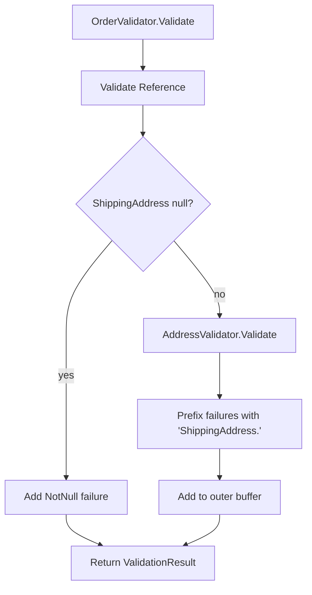

# Nested Validation

ZeroAlloc.Validation supports automatic validation of nested objects. When a property's type is itself decorated with `[Validate]`, the source generator wires up the nested validator at compile time — no runtime reflection required.

## Automatic nested validation

Nested validation is triggered when a property's type carries `[Validate]`. The generator detects this, declares a private readonly field for the nested validator, and injects it through the outer validator's constructor. `[NotNull]` is commonly added alongside for nullable properties, but it is not the trigger — the presence of `[Validate]` on the property's type is what drives code generation.

```csharp
[Validate]
public class Order
{
    [NotEmpty]
    public string Reference { get; set; } = "";

    [NotNull]
    public Address? ShippingAddress { get; set; }
}

[Validate]
public class Address
{
    [NotEmpty] public string Street     { get; set; } = "";
    [NotEmpty] public string City       { get; set; } = "";
    [NotEmpty] public string PostalCode { get; set; } = "";
}
```

The generator emits code equivalent to:

```csharp
public sealed class OrderValidator : ValidatorFor<Order>
{
    private readonly AddressValidator _shippingAddressValidator;

    public OrderValidator(AddressValidator shippingAddressValidator)
    {
        _shippingAddressValidator = shippingAddressValidator;
    }

    public override ValidationResult Validate(Order instance)
    {
        // ... direct property rules ...

        if (instance.ShippingAddress is not null)
        {
            var nestedResult = _shippingAddressValidator.Validate(instance.ShippingAddress);
            foreach (ref readonly var f in nestedResult.Failures)
                _buf.Add(new ValidationFailure
                {
                    PropertyName = "ShippingAddress." + f.PropertyName,
                    ErrorMessage = f.ErrorMessage,
                    ErrorCode    = f.ErrorCode,
                    Severity     = f.Severity
                });
        }

        // ...
    }
}
```

The nested validator is always injected via constructor — the generator never uses `new AddressValidator()` directly.

## Failure path prefixing

Failures from the nested validator are prefixed with the parent property name and a dot before being added to the outer result buffer. A failure on `Street` inside `ShippingAddress` surfaces as `"ShippingAddress.Street"`.

```csharp
// Without DI — pass nested validator manually
var validator = new OrderValidator(new AddressValidator());

var order = new Order
{
    Reference = "ORD-001",
    ShippingAddress = new Address { Street = "", City = "London", PostalCode = "" }
};

var result = validator.Validate(order);
foreach (ref readonly var f in result.Failures)
{
    Console.WriteLine($"{f.PropertyName}: {f.ErrorMessage}");
}
// Output:
// ShippingAddress.Street: Street must not be empty.
// ShippingAddress.PostalCode: PostalCode must not be empty.
```

## `[ValidateWith]` override

For property types that do not carry `[Validate]` — such as third-party or framework types — use `[ValidateWith]` to supply an explicit validator class. The specified type must extend `ValidatorFor<T>` where `T` is the property's declared type.

```csharp
public class ExternalAddress { ... }  // no [Validate]

public class MyAddressValidator : ValidatorFor<ExternalAddress>
{
    public override ValidationResult Validate(ExternalAddress instance)
    {
        // ... apply your rules ...
        return new ValidationResult([]); // return failures if any, or an empty result for success
    }
}

[Validate]
public class Order
{
    [NotNull]
    [ValidateWith(typeof(MyAddressValidator))]
    public ExternalAddress? ShippingAddress { get; set; }
}
```

> **Note:** Using `[ValidateWith]` on a property whose type already carries `[Validate]` produces a **ZV0011** compiler warning. The auto-generated validator is used by default; `[ValidateWith]` should only be needed for types you do not control.

`[ValidateWith]` is in the `ZeroAlloc.Validation` namespace. It accepts a `Type` constructor argument:

```csharp
[ValidateWith(typeof(MyAddressValidator))]
```

## Null-safety

Nested validation is skipped automatically when the property value is `null`. The generated code wraps the nested validator call in a null check:

```csharp
if (instance.ShippingAddress is not null)
{
    var nestedResult = _shippingAddressValidator.Validate(instance.ShippingAddress);
    // prefix and accumulate failures ...
}
```

When `[NotNull]` is also present, the null-check failure is added to the buffer independently — the nested call is still guarded and skipped when null, so no `NullReferenceException` can occur.

## Validation flow



## DI registration

Because the nested validator is constructor-injected, it integrates naturally with dependency injection. If you annotate your validators with `[Transient]`, `[Scoped]`, or `[Singleton]` from `ZeroAlloc.Inject`, the DI container resolves the full dependency graph — including nested validators — automatically.

Without DI, construct the dependency graph manually and pass each nested validator to the parent constructor:

```csharp
var addressValidator = new AddressValidator();
var orderValidator   = new OrderValidator(addressValidator);
```

Deeper nesting follows the same pattern: each level receives its nested validators through its own constructor.
